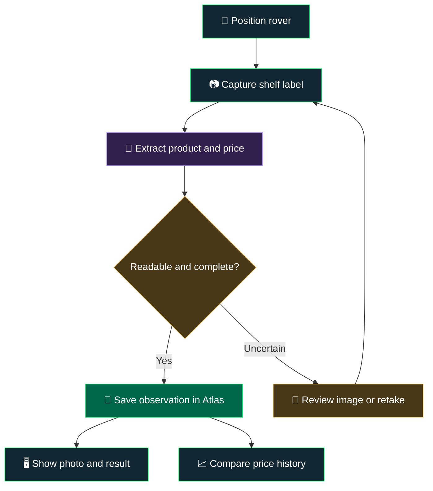

<div align="center">

# 🛒 Aisle Be Back

### A little rover. A shelf full of prices. A MongoDB Atlas adventure.

**Viam 🤖 · Camera 📷 · Price Extraction 🧠 · MongoDB Atlas 🍃**

*Giving a robot something useful to do between world domination attempts.*

</div>

---

## 👋 What's this?

A fun robotics project that turns a Viam rover into a shelf-price scout. The idea: roll up to a shelf, take a picture of the price labels, extract the product and pricing information, and save those observations in MongoDB Atlas.

The rover already exists. So does its camera. An **Ulanzi HD02 Magic Arm with Crab Clamp (10")** gives that camera an adjustable perch for a better view of the labels.

**The first win:** one real shelf label, one readable photo, one correct price in Atlas. Then we get ambitious.

> 🚧 **Status: project taking shape.** Hardware is available; camera remounting, extraction, Atlas ingestion, and the UI are the next steps. This README describes the intended build—not a finished application.

## 🧰 The cast

| Piece | Its job | Status |
| :--- | :--- | :--- |
| Viam rover | Carry the camera along the shelf | On hand |
| Existing rover camera | Capture shelf labels | On hand; ready to relocate |
| Ulanzi HD02 arm + crab clamp | Hold the camera at the desired height and angle | On hand |
| Viam software | Provide the camera and rover interface | Integration to verify |
| Python application | Coordinate capture, extraction, and writes | Planned |
| OCR or vision model | Turn label images into structured observations | To be selected |
| MongoDB Atlas | Store observations and price history | Planned integration |
| Streamlit | Show photos and extracted results side by side | Proposed demo UI |

The Ulanzi arm is a **manually adjustable camera mount**. Rover movement positions the whole rig; the arm sets the camera's view.

## 🗺️ From aisle to Atlas



**Start with manual driving and deliberate captures.** Automatic aisle patrol can be a later adventure once the camera-to-Atlas loop works.

## 📦 What lands in Atlas?

Each scan becomes a new observation, preserving what the camera saw and when it saw it. Repeated scans build a history instead of overwriting yesterday's price.

Suggested starting point: database `aisle_be_back`, collection `price_observations`.

<details>
<summary><strong>🍃 Peek inside an example observation</strong></summary>

Illustrative JSON below. Store timestamps as BSON dates in the application. This example stores USD amounts as integer cents.

```json
{
  "scan_id": "demo-scan-0001",
  "robot_id": "shelf-rover-01",
  "captured_at": "2026-09-24T15:00:00Z",
  "location": {
    "store_id": "demo-store",
    "aisle": "snacks",
    "shelf": "middle"
  },
  "product": {
    "label_name": "Ridiculously Crunchy Chips",
    "size_text": "8 oz",
    "sku": null,
    "barcode": null
  },
  "price": {
    "amount_minor": 499,
    "currency": "USD",
    "promotion_text": null
  },
  "capture": {
    "image_ref": "demo/scans/demo-scan-0001.jpg",
    "raw_label_text": "Ridiculously Crunchy Chips 8 oz $4.99"
  },
  "extraction": {
    "method": "to-be-selected",
    "review_status": "pending"
  }
}
```

`image_ref` is a placeholder for the chosen image-storage location. Missing identifiers stay `null`; we only record a barcode or SKU when we actually read or verify it. Location can be entered manually for the first demo.

</details>

## 🎬 The first demo

1. **Mount it.** Move the existing camera onto the Ulanzi arm and keep its connection to the rover.
2. **Frame it.** Aim at a shelf label and check focus, glare, distance, and text size.
3. **Snap it.** Capture a still image through the Viam integration.
4. **Read it.** Extract the label text, product name, and displayed price.
5. **Check it.** Compare the extraction with the photo; flag unclear labels for review.
6. **Save it.** Write the observation to Atlas.
7. **Change it.** Swap a demo price tag, scan again, and show the price history.

**Demo payoff:** the physical shelf changes, the rover sees it, and Atlas remembers it.

## 🧠 A few details that make it work

- **Keep the evidence.** Preserve an image reference and the original label text alongside the extracted fields.
- **Know which price you're reading.** Sale prices, unit prices, and “2 for $5” offers deserve separate treatment. Keep promotional wording rather than silently turning it into a single-item price.
- **Match before comparing.** Use a verified barcode or SKU when available. An uncertain product match should go to review before declaring a price change.
- **Make retries boring.** Reuse the same scan ID when retrying a write; give a genuinely new capture a new ID.
- **Start small.** One label per image makes the first extraction loop easier to inspect.

## 🚀 Side quests

| Level | Quest | Finish line |
| :--- | :--- | :--- |
| 1 · Eyes on the shelf | Mount and frame the camera | Readable label photo |
| 2 · Hello, Atlas | Extract and save a label | First verified observation |
| 3 · Mission control | Add a Streamlit view | Photo and data side by side |
| 4 · That used to be cheaper | Compare repeat scans | Price-change timeline |
| 5 · More snacks, fewer clicks | Extract multiple labels per image | Several distinct observations per capture |
| 6 · Shelf detective | Compare with a reference catalog | Flag a verified pricing mismatch |
| Bonus · Aisle patrol | Explore automated positioning | Repeatable capture route |

These are project ideas, not shipped features. The order is flexible. The snacks are negotiable.

## 🛠️ Running it

Application code and setup commands will be added as the capture and ingestion pieces are built. For now, the immediate milestone is a sample shelf-label image from the mounted camera.

---

<div align="center">

**Built for curiosity, questionable robot puns, and the satisfaction of seeing a real-world price land in a database.**

*Aisle be back. With receipts.* 🤖🧾

</div>
