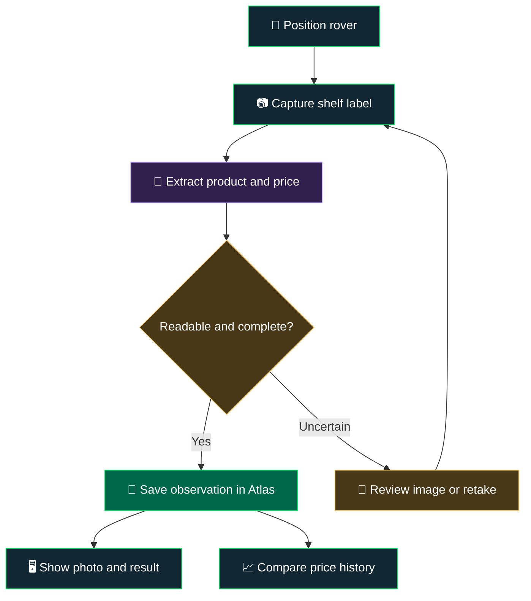

<div align="center">

# 🛒 Aisle Be Back

### A little rover. A shelf full of prices. A MongoDB Atlas adventure.

**Viam 🤖 · Camera 📷 · Price Extraction 🧠 · MongoDB Atlas 🍃**

*Giving a robot something useful to do between world domination attempts.*

</div>

---

## 👋 What's this?

A fun robotics project that turns a Viam rover into a shelf-price scout. The idea: roll up to a shelf, take a picture of the price labels, extract the product and pricing information, and save those observations in MongoDB Atlas.

The rover already exists. So does its camera. An **Ulanzi HD02 Magic Arm with Crab Clamp (10")** gives that camera an adjustable perch for a better view of the labels.

**The first win:** one real shelf label, one readable photo, one correct price in Atlas. Then we get ambitious.

> 🛠️ **Status: runnable starter examples.** Camera capture, AI extraction, reviewed Atlas ingestion, price history, and an optional Streamlit UI are implemented. Offline tests pass; live rover, OpenAI, and Atlas connections still need your credentials and hardware validation.

## 🧰 The cast

| Piece | Its job | Status |
| :--- | :--- | :--- |
| Viam rover | Carry the camera along the shelf | On hand |
| Existing rover camera | Capture shelf labels | On hand; ready to relocate |
| Ulanzi HD02 arm + crab clamp | Hold the camera at the desired height and angle | On hand |
| Viam software | Provide the camera and rover interface | SDK integration implemented; live check pending |
| Python application | Coordinate capture, extraction, and writes | Implemented |
| OCR or vision model | Turn label images into structured observations | OpenAI vision with structured output |
| MongoDB Atlas | Store observations and price history | Implemented |
| Streamlit | Show photos and extracted results side by side | Included as an optional example |

The Ulanzi arm is a **manually adjustable camera mount**. Rover movement positions the whole rig; the arm sets the camera's view.

## 🗺️ From aisle to Atlas



**Start with manual driving and deliberate captures.** Automatic aisle patrol can be a later adventure once the camera-to-Atlas loop works.

## 📦 What lands in Atlas?

Each scan becomes a new observation, preserving what the camera saw and when it saw it. Repeated scans build a history instead of overwriting yesterday's price.

Suggested starting point: database `aisle_be_back`, collection `price_observations`.

<details>
<summary><strong>🍃 Peek inside an example observation</strong></summary>

Illustrative JSON below. Store timestamps as BSON dates in the application. This example stores USD amounts as integer cents.

```json
{
  "scan_id": "demo-scan-0001",
  "robot_id": "shelf-rover-01",
  "captured_at": "2026-09-24T15:00:00Z",
  "location": {
    "store_id": "demo-store",
    "aisle": "snacks",
    "shelf": "middle"
  },
  "product": {
    "label_name": "Ridiculously Crunchy Chips",
    "size_text": "8 oz",
    "sku": null,
    "barcode": null
  },
  "price": {
    "amount_minor": 499,
    "currency": "USD",
    "promotion_text": null
  },
  "capture": {
    "image_jpeg": "<BSON binary JPEG stored by the code>",
    "raw_label_text": "Ridiculously Crunchy Chips 8 oz $4.99"
  },
  "extraction": {
    "method": "to-be-selected",
    "review_status": "pending"
  }
}
```

The runnable examples embed a resized JPEG as BSON binary in the observation, capped at 8 MB. The JSON above represents those binary bytes with a placeholder string. This keeps image evidence and metadata together for the small demo; object storage can be a later extension. Missing identifiers stay `null`; we only record a barcode or SKU when we actually read or verify it. Location can be entered manually for the first demo.

</details>

## 🎬 The first demo

1. **Mount it.** Move the existing camera onto the Ulanzi arm and keep its connection to the rover.
2. **Frame it.** Aim at a shelf label and check focus, glare, distance, and text size.
3. **Snap it.** Capture a still image through the Viam integration.
4. **Read it.** Extract the label text, product name, and displayed price.
5. **Check it.** Compare the extraction with the photo; flag unclear labels for review.
6. **Save it.** Write the observation to Atlas.
7. **Change it.** Swap a demo price tag, scan again, and show the price history.

**Demo payoff:** the physical shelf changes, the rover sees it, and Atlas remembers it.

## 🧠 A few details that make it work

- **Keep the evidence.** Preserve the image and original label text alongside the extracted fields.
- **Know which price you're reading.** Sale prices, unit prices, and “2 for $5” offers deserve separate treatment. Keep promotional wording rather than silently turning it into a single-item price.
- **Match before comparing.** Use a verified barcode or SKU when available. An uncertain product match should go to review before declaring a price change.
- **Make retries boring.** Reuse the same scan ID when retrying a write; give a genuinely new capture a new ID.
- **Start small.** One label per image makes the first extraction loop easier to inspect.

## 🚀 Side quests

| Level | Quest | Finish line |
| :--- | :--- | :--- |
| 1 · Eyes on the shelf | Mount and frame the camera | Readable label photo |
| 2 · Hello, Atlas | Extract and save a label | First verified observation |
| 3 · Mission control | Add a Streamlit view | Photo and data side by side |
| 4 · That used to be cheaper | Compare repeat scans | Price-change timeline |
| 5 · More snacks, fewer clicks | Extract multiple labels per image | Several distinct observations per capture |
| 6 · Shelf detective | Compare with a reference catalog | Flag a verified pricing mismatch |
| Bonus · Aisle patrol | Explore automated positioning | Repeatable capture route |

Levels 2–4 have starter code below. Multi-label extraction, catalog matching, and automatic driving remain future ideas. The snacks are negotiable.

## 🧪 Pick an example

Each numbered script is runnable on its own. The small `common.py` module shares camera, model, and database functions so fixes apply everywhere. `cli_support.py` handles local files and credential prompts.

| File | What it demonstrates | Needs |
| :--- | :--- | :--- |
| `00_make_sample.py` | Generate a synthetic label image and matching JSON | No services |
| `01_capture_camera.py` | Discover Viam cameras or capture a JPEG | Viam machine credentials |
| `02_extract_price.py` | Turn one image into editable structured price data | OpenAI API key |
| `03_save_to_atlas.py` | Validate and save a reviewed observation with its image | Atlas URI |
| `04_price_history.py` | Query one SKU/store and display observed price changes | Atlas URI |
| `05_rover_to_atlas.py` | Run the complete loop with a review pause | All three services |
| `streamlit_app.py` | Capture/upload, extract, review, save, and browse history | Choose the services you use |
| `config.py` | Shared local settings and optional credentials | Your values |
| `test_examples.py` | Offline money, image binding, retry, and camera lifecycle checks | No services |

## 🛠️ Get rolling

Use **Python 3.11 or 3.12**. Open a terminal in this folder:

```bash
python -m venv .venv
source .venv/bin/activate
python -m pip install -r requirements.txt
```

On Windows, activate with `.venv\Scripts\activate` instead.

Leave secrets blank in `config.py` to enter them at the CLI prompts, or paste them into the optional Streamlit sidebar. You can also fill in `config.py` locally. No `.env` required. Keep filled-in credentials out of commits; `config.py` is ignored by the included `.gitignore`, so use a blank copy if you deliberately add it to your repository.

Set camera name, model, database, and shelf location in `config.py`. The default vision model is `gpt-4.1-mini`; change it to an image-capable model with structured-output support available to your API project.

### 0 · Try the files without a robot or API key

```bash
python 00_make_sample.py
```

Creates `captures/sample.jpg`, its capture metadata sidecar, and `captures/sample.label.json`. This is explicitly synthetic data—no model pretends to read the image. Open the image and JSON to inspect the example.

### 1 · Give the rover eyes

Use your Viam machine address, API key ID, and API key. Match the camera component name exactly to its configured name. Check the camera in Viam first.

```bash
python 01_capture_camera.py --list
python 01_capture_camera.py --camera camera-1 --output captures/shelf.jpg
```

The script only captures images; drive and position the rover using your existing controls. The Ulanzi arm stays manually positioned. The camera connection closes after each command.

### 2 · Read the price

```bash
python 02_extract_price.py captures/shelf.jpg --output captures/label.json
```

For an ordinary photo, pass its path instead. External photos are normalized to a sibling `*.normalized.jpg`; use that normalized file when saving to Atlas. Images are resized to a maximum 1920-pixel edge.

Each execution makes one OpenAI request with no automatic retries. The image is sent to OpenAI and uses your API billing. No model calls run just because a Streamlit widget changes.

Open the output JSON and review **only the `label` fields** against the photo. Fix product, price, and currency as needed. Unknown values remain null; a bare `$` may leave currency unresolved. This first version accepts reviewed **USD single-item prices**, such as `4.99`. It will not silently convert “2 for $5” into a unit price.

### 3 · Land it in Atlas

Your Atlas database user needs read/write access to the selected database, and your machine must be able to reach the cluster through its configured network access.

```bash
python 03_save_to_atlas.py captures/label.json captures/shelf.jpg --reviewed
```

Or try the generated sample without calling OpenAI:

```bash
python 03_save_to_atlas.py captures/sample.label.json captures/sample.jpg --reviewed
```

The collection is `aisle_be_back.price_observations` by default. Each capture gets a UUID used as `_id`; retrying the same save does not create another observation or overwrite the first one. The source-image hash is verified before saving. A new camera capture or newly generated sample gets a new UUID.

Capture time and location are recorded when the image is acquired or imported. For uploaded photos, this is the import time, not inferred EXIF time. Atlas stores timestamps as BSON dates, USD prices as integer cents, and image bytes as BSON binary.

### 4 · See what changed

```bash
python 04_price_history.py --sku CHIPS-001 --store demo-store --include-samples
```

For real scans, omit `--include-samples`. Results are the latest 100 observations, displayed chronologically. Matching is exact SKU plus store; confirm the SKU and product identity during review. Promotional prices may have different terms.

To demonstrate a change, generate and save a second sample with a different price:

```bash
python 00_make_sample.py --output captures/sample-next.jpg --price 5.49
python 03_save_to_atlas.py captures/sample-next.label.json captures/sample-next.jpg --reviewed
```

The generator updates both the image and JSON so the evidence matches the price.

### 5 · Run the whole adventure

```bash
python 05_rover_to_atlas.py --output captures/live.jpg
```

Captures from Viam, extracts the label, and pauses. Open the photo and generated JSON, make corrections, then type `SAVE` to write to Atlas. Anything else exits with the local files retained. If the write fails, retry using example 03 with those same files rather than recapturing.

### Bonus · Mission control in Streamlit

```bash
python -m streamlit run streamlit_app.py
```

Choose **Viam camera**, **Upload image**, or **Sample label**. Enter credentials in the sidebar as needed. Extract with AI or type fields manually, review, and save. The history tab supports exact SKU/store filters and a price chart. The UI is a local, single-user demo; credentials and unsaved captures live in its session.

### Verify locally

```bash
python 00_make_sample.py
python -m unittest -v test_examples.py
```

The supplied versions were installed and checked with Python 3.12. Tests exercise exact monetary conversion, rejection of changed images and unsupported currency, the idempotent write contract, and camera cleanup on success and failure with mocked services. The Streamlit sample/manual-entry path was also checked locally. Live camera capture, paid extraction, and a real Atlas write require your environment and have not been executed here.

## 🔧 If a wheel falls off

| Symptom | Check |
| :--- | :--- |
| Camera not found | Run `--list`; component names are case-sensitive. |
| Camera timeout | Machine online, camera working in Viam, correct address and credentials. |
| No readable color image | Select the RGB camera component, not a depth-only source. |
| OpenAI authentication/model error | API key, API project access, billing, and configured model. |
| Atlas timeout | URI, network access, DNS, and database user permissions. |
| Price or currency rejected | Review `label.price_text` and `label.currency`; do not alter capture metadata. |
| Image hash mismatch | Use the exact captured/normalized JPEG associated with the JSON. |
| Save says already present | Expected retry behavior. Create a new capture for a new observation. |

## 📚 API references

- [Viam camera setup](https://docs.viam.com/hardware/common-components/add-a-camera/)
- [Viam Python camera API](https://python.viam.dev/autoapi/viam/components/camera/index.html)
- [OpenAI image inputs](https://developers.openai.com/api/docs/guides/images-vision)
- [OpenAI structured outputs](https://developers.openai.com/api/docs/guides/structured-outputs)

---

<div align="center">

**Built for curiosity, questionable robot puns, and the satisfaction of seeing a real-world price land in a database.**

*Aisle be back. With receipts.* 🤖🧾

</div>
